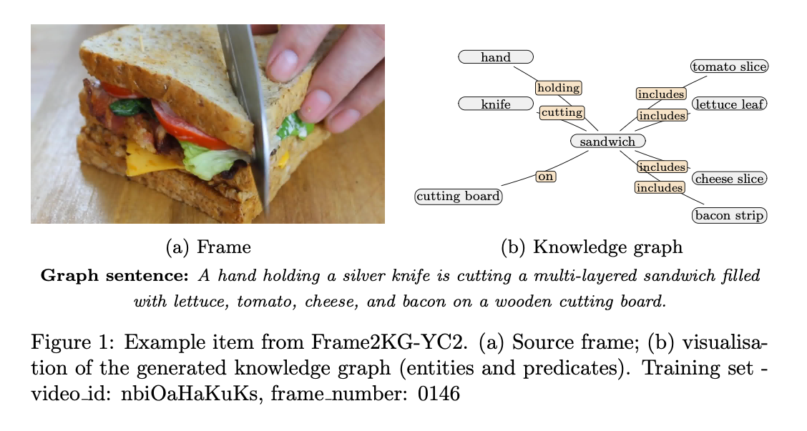

# Frame2KG Documentation Hub

Frame2KG aggregates the data, models, and tooling introduced in *Frame2KG-YC2: A Synthetic Dataset, LoRA Adapters, and an Evaluation Toolkit for Frame → Graph*. The goal is to provide a single launch point for reproducible frame-to-knowledge-graph research focused on interpretable, on-device robotics.



## Project Resources
- Dataset: Frame2KG-YC2 synthetic corpus ([HuggingFace Repo](https://huggingface.co/datasets/lewiswatson/Frame2KG-YC2))
- Synthetic Dataset Creation Scripts ([Dataset Generation](https://github.com/lewiswatson55/Frame2KG/blob/master/DatasetGeneration/readme.md)) 
- Training pipeline: Frame2KG-Trainer for Qwen2.5-VL LoRA adapters ([Frame2KG Trainer](https://github.com/lewiswatson55/frame2kg-trainer))
- Evaluation toolkit: Deterministic frame2kg-eval matcher and metrics ([Frame2KG_Eval_Benchmark](https://github.com/lewiswatson55/frame2kg_eval_benchmark))
- Adapters: Released LoRA checkpoints (3B/7B; QKVO ± GateProj) [HuggingFace Collection](https://huggingface.co/collections/lewiswatson/frame2kg))
- Ablations: Effect of adding MLP gating (GateProj/Up/Down) on Node/Edge F1µ and IoU ([read the ablation summary](https://github.com/lewiswatson55/Frame2KG/blob/master/Ablation/effect_of_adding_gate.md))
- Paper: Frame2KG baseline reports and comparison results ([coming soon](#))
- Appendix details ([Appendix.md](https://github.com/lewiswatson55/Frame2KG/blob/master/appendix.md))

## Update Log
2026-04-13:
- Improved evaluation efficiency (shared embedding model, reduced per-frame overhead)
- Standardised evaluation defaults for node text fields (`label, attributes`)

> **Note on evaluation:**  
> The evaluation toolkit uses `label, attributes` as the default node text fields.  
> For exact reproduction of the LREC 2026 paper results, please refer to the evaluation repository documentation.

## Citing
```bibtex
@inproceedings{watson2026pair,
  title = {Frame2KG: A Benchmark and Evaluation Toolkit for Interpretable Frame-to-Graph Generation},
  author = {Watson, Lewis and Strathearn, Carl and Mitchell, Kenny and Yu, Yanchao},
  booktitle = {LREC 2026: Language Resources and Evaluation Conference},
  year = {2026},
  month = {May},
  address = {Palma, Mallorca},
  publisher = {European Language Resources Association (ELRA)},
  url = {https://lrec2026.info/}
}
```

## Contact
For questions or collaboration inquiries, reach out to `l.watson{at}napier.ac.uk`.
> Replace {at} with @
